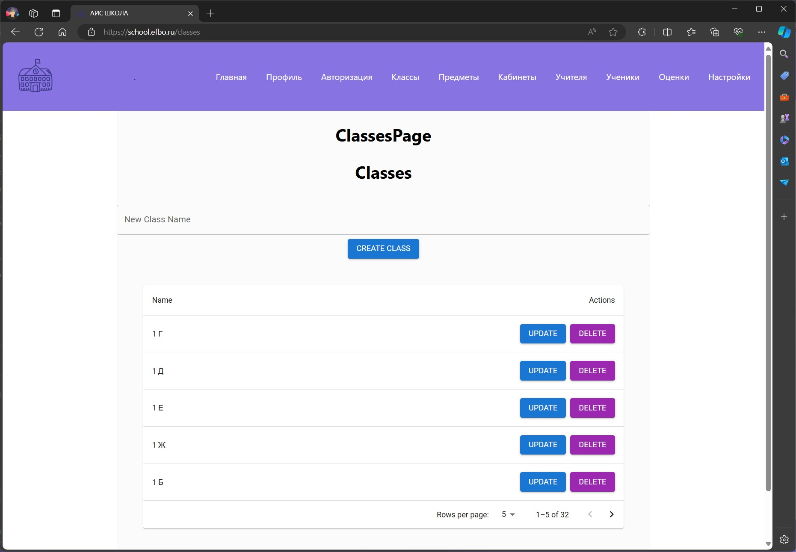

# Школа (АИС Школа)

## О проекте
Школа - это программная система, предназначенная для управления школой.


# Содержание <a name="Содержание"></a>
* [Содержание](#Содержание)
* [Роли в команде](#Роли)
* [Стек технологий](#Стек)
* [Use Case Диаграмма](#usecase)
* [База данных](#БДшка)
* [API и SWAGGER](#API_SWAGGER)
* [Docker](#Docker)


# Роли в команде <a name="Роли"></a>
* Тимлид [Кириченко Н.Д.](https://github.com/KirichenkoND)
* Frontend-Разработчик (Разработчик) [Кирилин Г.Д.](https://github.com/FaneOfficial)
* Backend-Разработчик [Шустров В.Р.](https://github.com/ItsEthra)


# Стек технологий <a name="Стек"></a>
В этом проекте используется следующий стек технологий:
* СУБД - PostgreSQL
* Frontend - React + TS + Vite
* Backend - Rust


# Use Case Диаграмма <a name="usecase"></a>


# База данных <a name="БДшка"></a>
В данной программной системе используется СУБД PostgreSQL.
Структура базы данных выглядит следующим образом:


# API и SWAGGER <a name="API_SWAGGER"></a>
Swagger расположен по следующей ссылке: [*swagger*](http://api.school.efbo.ru/swagger-ui/)


## Описание макетов приложения
1. Авторизация


1. Главная страница


1. Профиль


1. Классы



1. Предметы


1. Кабинеты


1. Учителя


1. Ученики


1. Оценки


1. Настройки


# Docker <a name="Docker"></a>
Для сборки проекта необходимо скачать и установить docker. 
* Windows<br>Скачать с официального сайта Docker
* Linux<br>```sudo apt install docker```


# Сбор и запуск контейнера backend в Docker
```
cd backend
docker build -t school-backend .
docker run --name securitypass-backend -e DATABASE_URL=<postgres_url> -d -p 9009:9000 securitypass-backend
```


# Сбор и запуск контейнера frontend в Docker
```
cd frontend
docker build -t school-frontend .
docker run --name securitypass-frontend -d -p 7005:5173 securitypass-frontend
```